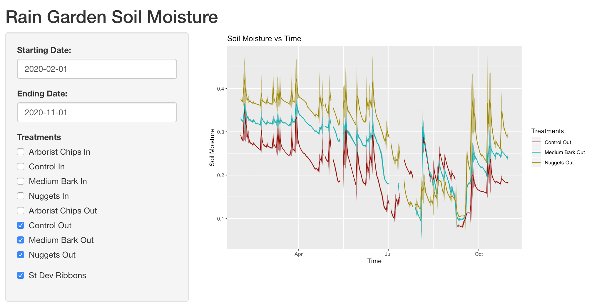
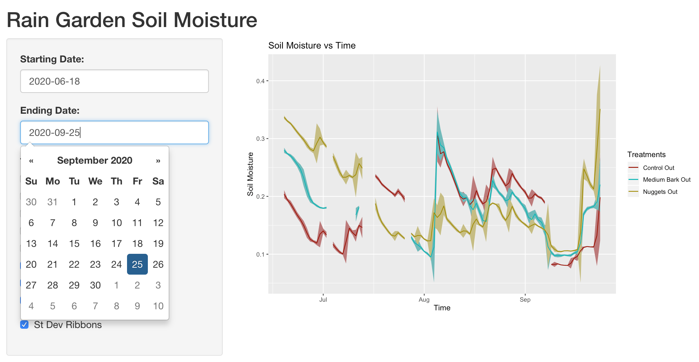

# lid
Scripts written during my work for Professor Ani Jayakaran and the Washington Stormwater Center.
### Rainfall Events
Professor Jayakaran runs two experiments, one examining flow through a set of permeable pavements, and one that examines flow through a set of raingardens (both experiments are larger in scope, this is just a specific slice of the work we do. For more information, visit [here](https://www.wastormwatercenter.org/project/rain-gardens-at-wsu/) for the rain garden experiment and [here](https://www.wastormwatercenter.org/project/idea-school/) for the pavement study.) In order to accurately sample water as it is flowing through our systems, we need to have general knowledge of how much water has passed at any given time (or in other words, what percentage of the total water has already passed through the system). In order to gain a ballpark measurement, I created a simple linear regression model based on previous natural storm events. This model would be able to predict, based on how much rainfall was measured for a storm, how much flow would be detected by sensors in the system. From this, we would gain a prediction on how much water would pass through our raingardens and permeable pavements based on how large a storm event we were planning to run (how much water we were planning to push through the system). This work can be seen in the files rainfall_notebooks/rain_event_finder_asphalt.ipynb, rainfall_notebooks/rain_event_finder_concrete.ipynb, and rainfall_notebooks/rain_event_finder_rg.ipynb.

### Soil Moisture Analysis
Another aspect of the [raingarden study](https://www.wastormwatercenter.org/project/rain-gardens-at-wsu/) is soil moisture. We have 4 raingarden mulch treatments, each with 4 replicates. The behavior of water in each of these raingardens has large implications. Optimal plant varieties depend on the moisture of each raingarden's soil. The soil_moisture folder contains the r scripts used to grah the soil moisture of these raingardens over time. There are several incarnations of this analysis, the most prominent of which uses the DPLYR package. Because of the high granularity of the data, I performed a series of operations to clean up the data:
1. Group data by date, aggregating using the mean
2. Average the four replicates of a treatment
Using the notebook, one can graph whichever treatments you wantm and however many you want, on any date range on a single graph. These graphs are stored as png files in the graphs/ subfolder.
#### Shiny Web App
Fully functioning Shiny Web App contained in soil_moisture/app.R.

